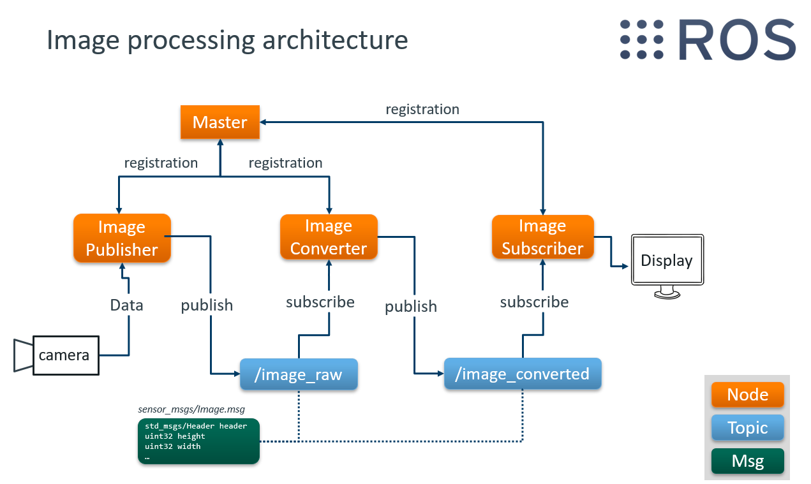

# ROS Image Processing

## Abstract
This repository demonstrates how to use ROS to process a basic image from a video stream. The image is published by one node, grayscaled by another and then subscribed to by a third one.

## Prerequisites
[ROS Kinetic](http://wiki.ros.org/kinetic/Installation)

## Architecture
<p align="center">
	
</p>

## How do i run this code?
Create a package "camera_test" with the catkin build system. Put the content from the folder "camera_test" from this repository inside.

Build package
```
$ catkin_make
```

Run image publisher
```
$ rosrun camera_test image_publisher 1
```

Run image converter
```
$ rosrun camera_test image_converter
```

Run image subscriber
```
$ rosrun camera_test image_subscriber 1
```

Two windows should open. One with the original RGB image and one grayscaled image.

## Libraries
[ROS Kinetic](http://wiki.ros.org/kinetic)

[OpenCV](https://opencv.org/)
